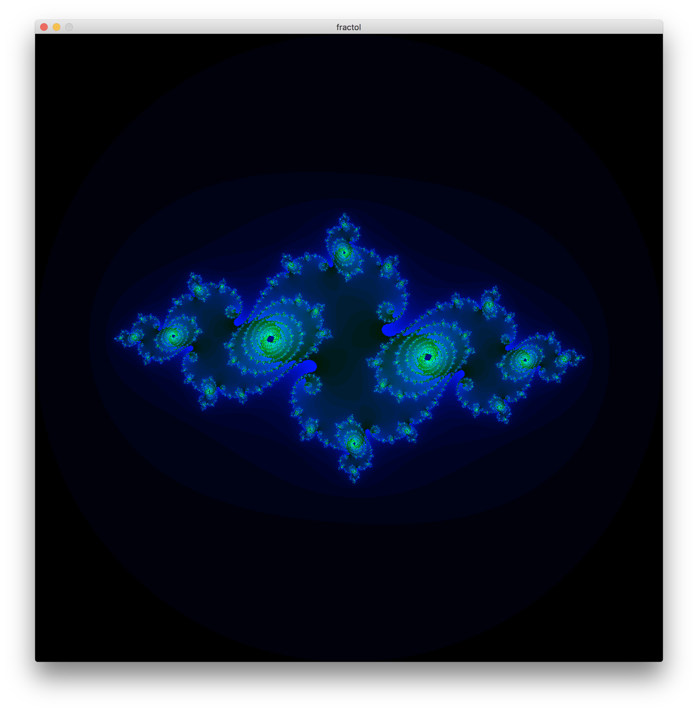
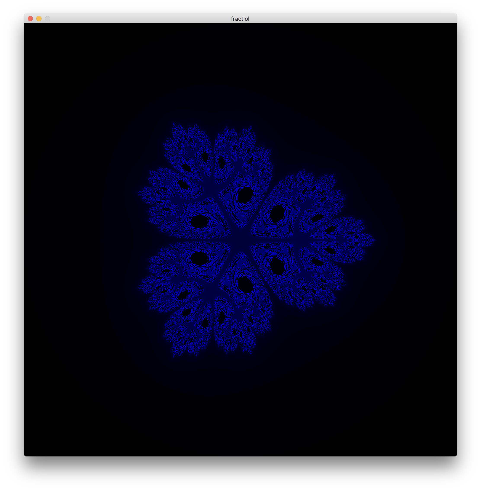
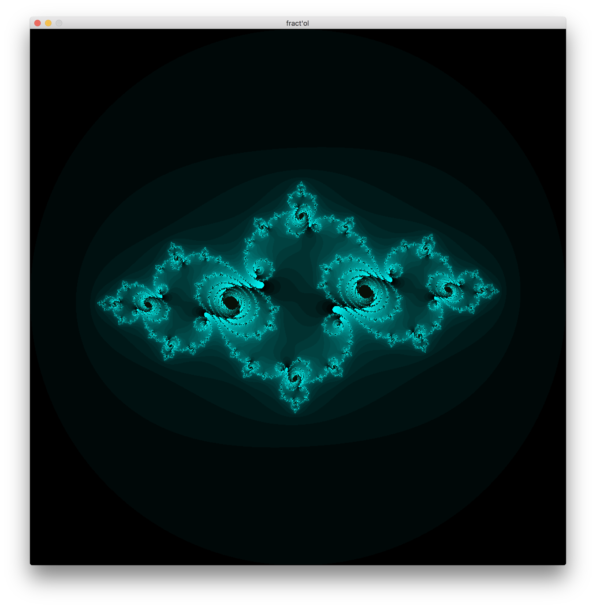
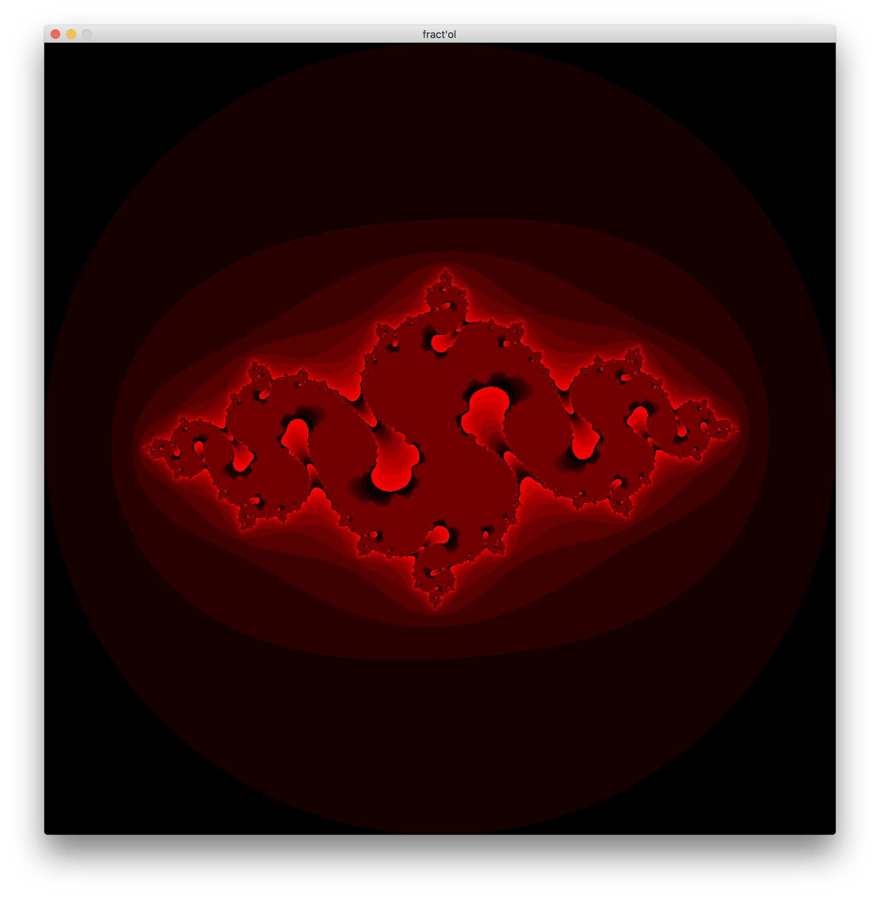
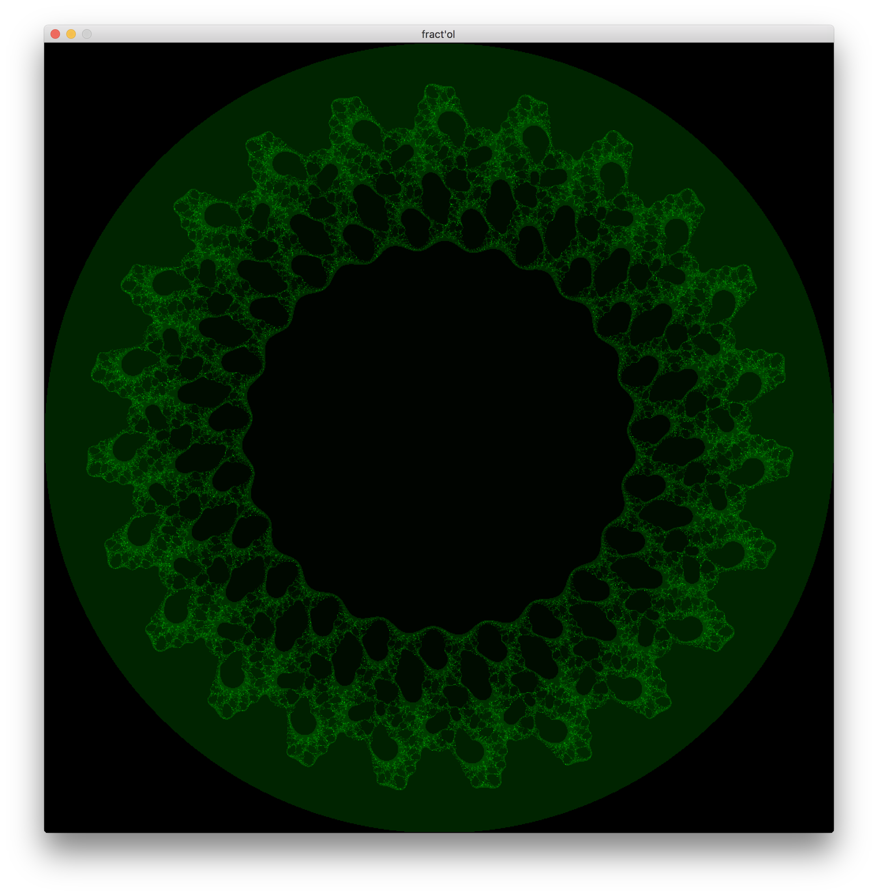
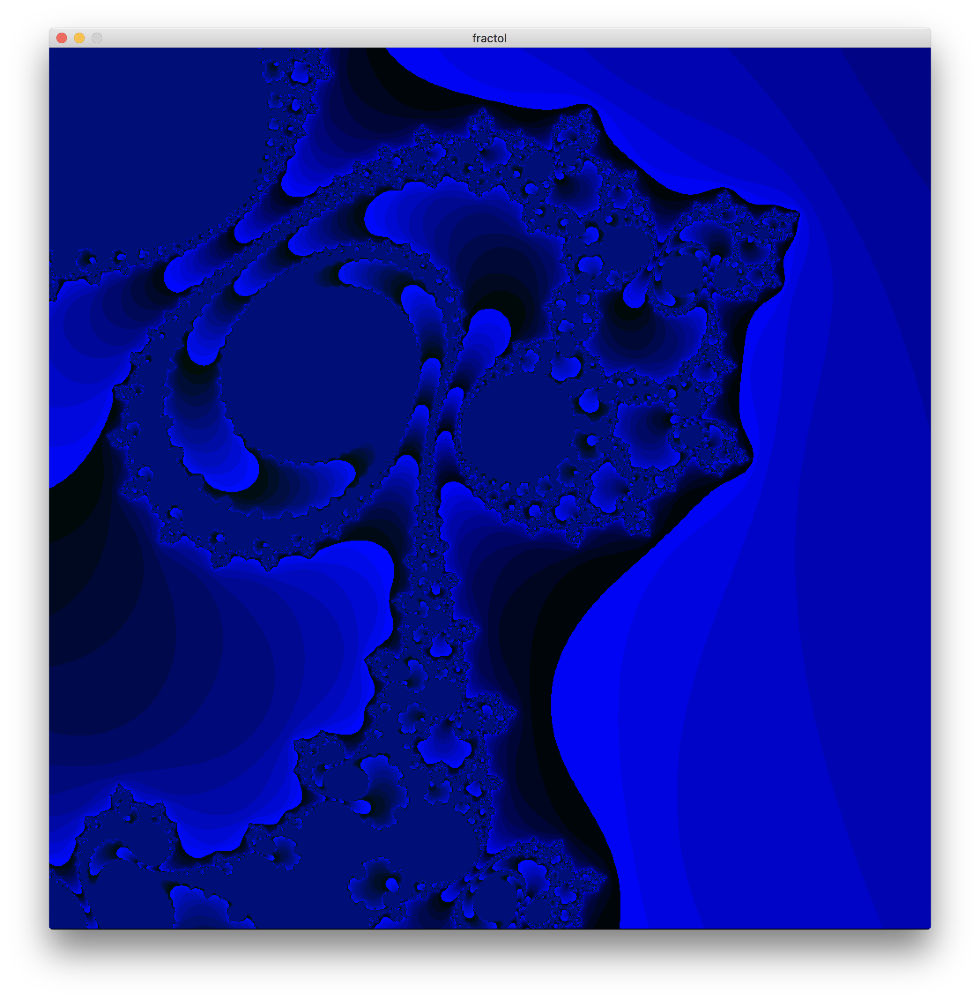

# fractol

Written in C using MinilibX

Developed on macOS High Sierra using clang-902.0.39.1

## Installation

```bash
git clone https://github.com/bombblob/fractol fractol
cd fractol
make
```

## Usage

```bash
./fractol a=2 t=julia
```

| Command    | Description                     |
| ---------  | ------------------------------- |
| Q/Esc      | kill program                    |
| Space      | toggle text                     |
| Ret        | reset view                      |
| R          | reset values                    |
| C          | toggle colors                   |
| 0-9        | integer argument                |
| N          | make argument negative          |
| E          | evaluate arg (Mandelbrot/Julia) |
| L          | lock mouse (Julia only)         |
| Del        | reset integer argument          |
| M          | reload last integer argument    |
| Tab        | cycle fractals                  |
| +/-        | inc/dec iters                   |
| Arrow keys | move around                     |
| Scroll     | zoom in/out                     |
| \[ \]      | change palette                  |







